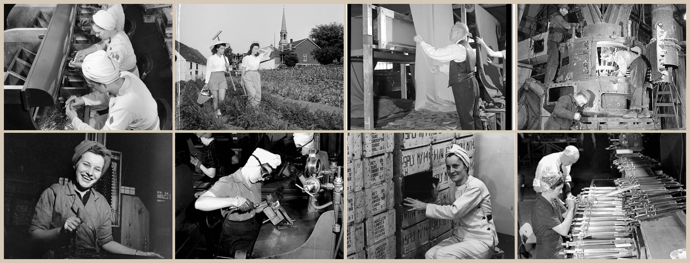

# workspaceAlberta Harness

  

<em>加拿大战时工业生产，图片来自加拿大图书档案馆。</em>

面向 CEO、为实际工作构建与交付而定制的企业级 AI 终端。它基于 MIT 许可的 [DeepSeek Harness](https://github.com/deepseek-ai/deepseek-harness)（`dsh`），由 Warre & Vavasour 作为产品运营。启动说明见 [WORKSPACE_ALBERTA.md](WORKSPACE_ALBERTA.md)。

## 给“要是能这样就好了……”一个地方

要是你多年来一直想着的点子，终于有个地方能让它成为现实，那该多好？

我们正在打造这样的地方：一个由 Warre & Vavasour 安装和支持的 CEO 实体工作空间。你继续经营企业，带来想做的东西，或一直希望能修好的小麻烦。我们与你一起接好工具，持续推进，做出企业真正能用的成果。

这就是 **AI 支持的家庭医生模式**：有人了解你的企业，记得你尝试过什么，帮助推进点子或长期积压的小问题，并引入合适的专业工具。我们照看工具的运行；你带来“要是能这样就好了……”的想法。

起点是 MCP：通过 CanadaBuys 和 Alberta Purchasing Connection 寻找真实公共采购机会，再沿着这条连接向前走。新产品、新服务，或工具到位后团队能够承接的新业务。我们一起确定工作范围和连接，并跟进交付。

**终端每月 4,800 加元**，包括租用的实体工作空间、安装与入门、持续支持、更新，以及约定的工作流程构建协助。这里既是把抱负变成新业务的地方，也是一段持续的合作。

### 你的项目，你的 Pi，身边的支持

WorkspaceAlberta 是通过 Tailscale 连接以提供支持的设备网络。每台本地部署的 Pi 运行 workspaceAlberta harness，点子和小修小补在其中成为项目。企业主可以自由地把想法说出来，试验并继续推进，不必让工程师旁听每一个念头。

我作为通才，了解企业和它的工具，需要处理问题时就出现。我照看着约 20 台分布式设备，设备放在相互信任的企业里。我认为这会成为一种新的工作：帮助企业部署、维护并真正使用 AI 工具。

我与工作空间保持连接。遇到困难时，我会进入你的设备，与你一起构建。WorkspaceAlberta 让本地工具持续运转；我处理需要工程师的部分。这台 Pi 就是前线部署工程师的工具箱，就在工作现场。

小事也可以带来：一直想要的文档、没人有时间修的繁琐步骤、从未开始的点子。每个请求都不需要正式提案或收入预测。我们快速构建、尝试、迭代；行不通就换下一个想法。25% 新增收入分成只属于单独的百万级挑战，不适用于工作空间里的每个项目。

支持权限由双方配置。Tailscale 不代表客户之间可以互相访问设备，也不保证即时响应，更不意味着远程模型和云工具都在本地运行。访问权限、支持时间和数据处理方式会在安装时约定。

### 一家企业，一个百万加元级的问题，六十天

我们向一家入选的加拿大企业提供**一台安装好并附带支持的终端**，解决一个值得解决的百万加元级问题。任何加拿大企业都可以提出自己的想法。

**我们有 60 天找到、解决并交付一个解决方案；如果做不到，双方就此结束。** 入选企业在这 60 天内不支付终端月费。我们要求的交换条件是：**获得该解决方案实际创造、可归因的新增收入的 25%**，并在开始前写入协议。新收入、新业务、新产品。分成绝不以节省的成本、已有收入或预测数字为依据。

我们不偷工减料，不裁减员工。我们来建设。这是为了做更多事而投入。这里既容得下大抱负，也容得下那些一直没时间处理的小事。

证明来自实际经济活动：交付的方案、新业务、已支付的发票、赚到的加元。你核算你的收入，我们核算我们的收入，各自履行适用的纳税义务。如果我们一起创造价值，就一起赚取应得的部分。

[告诉我们你的想法](mailto:hello@warreandvavasour.com?subject=Our%20million-dollar%20problem)。[服务与交付条款](https://github.com/HarleyCoops/WorkspaceAlberta/blob/main/docs/terminal-offer.md)说明了 60 天的边界，以及开始前要约定的收入归因和分成期限。

若我们未能按约定期限交付，不产生终端费或成功费。百万级问题是我们的抱负，不是收入保证。

### 工作经验告诉我们接下来构建什么

我也在实验如何使用 workspaceAlberta harness 的轨迹：试过什么、哪里失败、用户纠正了什么、最后什么起了作用。这些证据可以改进 harness、连接和工具。进一步的强化学习训练是研究方向，需要独立的许可和评估流程。客户会话不会自动成为训练数据。

Cohere 模型家族是这项工作加拿大来源的一部分。我们希望建设加拿大能力，帮助加拿大企业赚取加元。模型来源与数据处理地点是两回事，每次部署都需要说明实际路径。

我们的信念很简单：**AGI 已经到来。让我们把想做的都做出来。**

## 三个仓库，一段持续的合作

- [WorkspaceAlberta](https://github.com/HarleyCoops/WorkspaceAlberta)：采购 MCP 连接和共享工具。
- [workspaceAlbertaSetup](https://github.com/HarleyCoops/workspaceAlbertaSetup)：安装、实体工作空间和支持手册。
- [workspacealberta-harness](https://github.com/HarleyCoops/workspacealberta-harness)：工作会话、工具执行、交付文件和经审核的改进。

CEO 带来点子，安装工作提供场所，MCP 连接实际工作，harness 帮助持续推进。Warre & Vavasour 与企业并肩合作。

## workspaceAlberta 是什么

workspaceAlberta 将两件事结合在一起。

**通过 [CanadaBuys](https://canadabuys.canada.ca) 展示当下工业工作机会的服务**，由 Workspace Alberta procurement server 直接送入终端，让机会与执行工作的机器位于同一处。

**能够构建成果的终端。** 这是工作工具：编写代码、文件和文档。它不是陪聊者，也不是朋友。开始工作吧。

## 通过审核纠正改进采购工作

**两个文件，两种运行周期。** [采购 skill](.agents/skills/wa-procurement-base/SKILL.md)每次任务从当前输入开始，核查 CanadaBuys 和 Alberta Purchasing Connection 的证据，输出简短投标摘要。[改进 skill](.agents/skills/wa-procurement-improver/SKILL.md)独立运行，核查人工反馈，每次最多通过 PR 提出一项小范围流程改动，由人工决定是否合并。

- **先查证据，再判断适配。** 核查强制资质、担保、保险、截止时间和修订。未知条件表示适配不确定，确认不匹配才表示低适配。
- **流程跨会话保留。** 经审核的 skill 及资源保存在 git 中。客户细节和临时反馈摘要不会变成全局指令。
- **审核过程可见。** 每项提案包含证据、纠正示例、反例、检查和回滚方式。改进流程禁止自动合并或直接写入目标分支；权限受限的凭据负责强制执行。
- **衡量有用的工作。** 记录生成实用摘要所需时间、人工标签纠正，以及虚构截止时间或 ID 的次数（目标为零）。每日计划本身不保证改进。

这些 skill 使用现有 harness 发现机制。[部署与两种运行周期](WORKSPACE_ALBERTA.md#procurement-two-files-two-clocks)说明任务调用、工作日维护任务、凭据和终端更新。调度与设备部署独立于文件发布。

## 原则

我们希望听到你对企业的每一个“要是能这样就好了”的想法，像家庭医生一样与你一起实现。workspaceAlberta 背后的 AI 实验室 **Warre & Vavasour** 负责让各项工具正常运行，让 CEO 专注于在工作空间里落实新想法。

我们不做应用，不替代员工。设备的能力会令你惊讶；请带来最好的想法，一起把业务做大，而不是想着减少人员。我们放大已经奏效的工作。

## 加拿大能力，深入硬件

workspaceAlberta 建设加拿大能力，并明确说明处理路径：

- **仅使用加拿大 LLM。** 默认模型来自加拿大公司 Cohere，此部署没有其他模型提供方。每位客户都需要确认模型端点和处理地点。
- **加拿大云部署。** workspaceAlberta 服务层部署在加拿大云基础设施上。
- **欧洲硬件，可移除的加拿大数据。** 终端采用欧洲制造的 Raspberry Pi 5，并在**设备底部安装 Swissbit 工业级 SSD，让企业文件实际保存在可取下、拿在手里的存储器上。** 本地存储可物理移除；经授权的云模型和工具调用也会将数据传出设备。
- **最后一段：加拿大沙箱。** 隔离执行目前依赖非加拿大沙箱提供方；我们正在评估可承担 e2b 沙箱职责的加拿大替代方案。当工作负载需要时，也会补上这一环。

## AI 伦理

**Warre & Vavasour 不替代人类员工。我们帮助你把业务做大。** 每项交付能力都用于增强现有员工的工作能力，正如上方照片所代表的那一代人推动了国家工业化。以裁减人员为起点的节约计划不属于 workspaceAlberta。

**Warre & Vavasour 不做应用或聊天机器人。请不要提出这种要求。** 如果你的商业计划是这样，你需要重新思考新业务。我们构建交付实际成果的终端：代码、文件、文档，而非聊天组件。

**Warre & Vavasour 承认这项技术消耗着惊人的资源。** 训练和推理消耗真实的能源、水和矿物资源，而没有人要求这一切发生。也没有人特意要求 GRPO 在 1 月 20 日发布。但它发布了，模型开始推理，随后出现了 harness。世界就是如此。能够加快从点子到收入的桌面推理工具，成本已经低到不应忽视。

我们承认这些成本，公开讨论而不掩饰。我们的回应是加拿大基础设施、在你拥有的硬件上使用规模合适的模型，以及本地数据保留，避免重复的云端扩张。仿佛回到 1834 年，铁路已建，轨道周二就到。世界正在改变，workspaceAlberta 帮助你走在变化之前。

## 上游：DeepSeek Harness

本仓库在上游 `dsh` 代码库中承载 workspaceAlberta 部署层，包括 `workspace-alberta` 分支上的品牌、模型路径、预设和部署补丁。上游项目采用一切皆插件的架构，由 [Cordis](https://github.com/cordiverse/cordis) 驱动，目前处于开发者预览阶段，迭代迅速；同步上游时需要预期兼容性破坏。

- 上游文档：[开发指南](docs/development.md)、[架构](docs/architecture.md)、[Web UI 指南](docs/user/guide/index.md)（[English](README.md)）
- 社区：上游 [GitHub Discussions](https://github.com/deepseek-ai/deepseek-harness/discussions)、[`dsh-plugin`](https://github.com/topics/dsh-plugin) 主题和上游 [Discord](https://discord.gg/Ycq5dCaS4)

## 运行

使用 [Workspace Alberta 部署说明](WORKSPACE_ALBERTA.md)配置模型和采购连接。

### 从源码运行

使用 `pnpm install` 安装依赖，再按部署说明执行构建和启动命令。上游贡献者工作流程见[开发指南](docs/development.md)。

## 许可证

[MIT](LICENSE)。第三方依赖及其许可证见 [THIRD_PARTY_NOTICES.md](THIRD_PARTY_NOTICES.md)。
